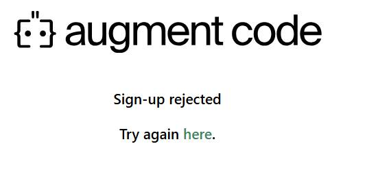

# AugmentMagic 配置指南

# 配置指南

> 🔒 安全提示：本方案经过验证，正确配置后不会导致账号封禁；遇到问题先看下方的常见问题
> 

## 📋 目录

- [概述](about:blank#%E6%A6%82%E8%BF%B0)
- [准备工作](about:blank#%E5%87%86%E5%A4%87%E5%B7%A5%E4%BD%9C)
- [环境配置](about:blank#%E7%8E%AF%E5%A2%83%E9%85%8D%E7%BD%AE)
- [软件安装](about:blank#%E8%BD%AF%E4%BB%B6%E5%AE%89%E8%A3%85)
- [使用指南](about:blank#%E4%BD%BF%E7%94%A8%E6%8C%87%E5%8D%97)
- [平台特定说明](about:blank#%E5%B9%B3%E5%8F%B0%E7%89%B9%E5%AE%9A%E8%AF%B4%E6%98%8E)
- [常见问题](about:blank#%E5%B8%B8%E8%A7%81%E9%97%AE%E9%A2%98)
- [支持与反馈](about:blank#%E6%94%AF%E6%8C%81%E4%B8%8E%E5%8F%8D%E9%A6%88)

## 📖 概述

AugmentCode 是一款 AI 代码助手插件，本指南将帮助您完成完整的配置流程。

### 💡 激活方式

- **免费方式**：观看广告获取激活码
- **付费方式**：[咸鱼店铺](https://m.tb.cn/h.hL1T4Eg?tk=4ePN4TldvbF) **获取长期激活码**

### 📞 技术支持

- **QQ交流群: 194862851**

## ⚠️ 重要提醒

1. **严格按照文档步骤操作**，所有步骤均基于实践经验总结
2. **首次配置较为复杂**，后续使用仅需2分钟
3. **网络环境**：根据注册情况灵活开启/关闭代理
4. **插件版本**：必须使用指定版本，避免兼容性问题
5. **macOS用户**：请参考 [macOS特定说明](about:blank#macos-%E4%BD%BF%E7%94%A8%E8%AF%B4%E6%98%8E)

## 🛠️ 准备工作

### 系统要求

- **操作系统**：Windows 10/11、macOS 10.15+
- **编辑器**：VSCode、Cursor 或 JetBrains 系列
- **网络**：稳定的网络连接（可能需要代理）

### 网络配置

### 代理服务（可选）

如遇到注册问题，可使用以下代理服务：

- **免费渠道**：[https://web3.52pokemon.cc/register?code=7otRr7Ay](https://web3.52pokemon.cc/register?code=7otRr7Ay)
- **优惠码**：鸡你太美

> ⚠️ 免责声明：代理服务仅用于解决注册问题，请自行承担使用风险
> 

### 推荐代理客户端

如遇验证码获取问题，建议使用：[Clash Verge Rev v2.3.2](https://github.com/clash-verge-rev/clash-verge-rev/releases/tag/v2.3.2)

## 🌐 环境配置

### 指纹浏览器配置

指纹浏览器用于解决地域限制问题，配置步骤：

1. **详细配置文档**：[浏览器环境配置指南](https://www.notion.so/AdsPower-24722957056580138f05f35d4c58d2bf?pvs=21)
2. **视频教程**：[指纹浏览器配置视频](https://www.notion.so/23f2295705658017aa22d69fca2e0a90?pvs=21)

> 💡 提示：首次配置较为复杂，但完成后后续使用将非常流畅
> 

## 📦 软件安装

### 下载资源

**夸克网盘**：[https://pan.quark.cn/s/7ee47d3b703a](https://pan.quark.cn/s/7ee47d3b703a)

### 💎 网盘会员获取渠道


### ⚠️ 插件版本兼容性

- **VSCode/Cursor**：必须使用网盘中的指定版本
- **JetBrains 系列**：必须使用网盘中的指定版本
- **严禁混用版本**：不同版本组合可能导致账号风险


软件下载界面

## 🚀 使用指南

### 步骤 1：获取激活码

### 方式一：免费获取

1. 扫描二维码
2. 观看广告获取激活码
3. 如无法获取，尝试切换网络（手机热点或代理）
    
    
    

### 方式二：付费获取

- [咸鱼店铺](https://m.tb.cn/h.hL1T4Eg?tk=4ePN4TldvbF)
- 获得长期有效激活码

### 步骤 2：重置机器码

1. 点击”执行程序”按钮
2. 运行内置重置工具
3. 等待获取新的机器码


机器码重置界面

### ⚠️ 常见提示处理

如出现 JetBrains 相关错误提示：


JetBrains错误提示

**解决方案**：
- 此错误表示未安装 JetBrains IDE
- 如未使用 JetBrains 产品，可忽略此提示
- 继续执行后续步骤即可

> 💡 macOS 提示：macOS 系统交互可能无日志输出，点击重置后直接进行下一步
> 

### 步骤 3：编辑器配置与登录

### 3.1 插件安装

**Cursor 用户注意**：
- 如搜索不到 AugmentCode 插件，请从网盘下载 `.vsix` 文件手动安装
- 安装方法：扩展 → 从 VSIX 安装

### 3.2 界面布局调整（可选）

如需调整为垂直布局，在 `settings.json` 中添加：

```json
"workbench.activityBar.orientation": "vertical"
```

### 3.3 登录流程

1. **启动登录**
    - 点击编辑器中的 “Sign In” 按钮
    - 系统将跳转到 AugmentCode 网站


编辑器登录界面

1. **重要：使用指纹浏览器**
    - **必须**将登录链接复制到指纹浏览器中打开
    - 不要在默认浏览器中登录
2. **清除信任域名**（如已信任过该域名）
    - 按 `Ctrl + Shift + P` 打开命令面板
    - 搜索 “trusted domains”
    - 删除 AugmentCode 相关域名


信任域名管理


域名删除界面

> ⚠️ 网络建议：每次注册前建议重新创建浏览器环境，并开启全局代理
> 

### 步骤 4：邮箱生成与账号注册

### 4.1 生成临时邮箱

1. 点击”生成邮箱”按钮
2. 系统自动生成临时邮箱地址
3. 点击”复制”按钮保存邮箱地址

### 4.2 注册 AugmentCode 账号

1. **访问注册页面**
    - 在指纹浏览器中打开 AugmentCode 注册页面
    - 使用生成的临时邮箱地址注册
2. **邮箱验证**
    - 注册后点击”获取验证码”按钮
    - 系统自动从邮箱获取验证码
    - 输入验证码完成注册

### 4.3 验证码获取问题排查

如无法获取验证码，请尝试以下解决方案：

1. **更换代理客户端**
    - 推荐使用：[Clash Verge Rev v2.3.2](https://github.com/clash-verge-rev/clash-verge-rev/releases/tag/v2.3.2)
    - 配合推荐的代理服务使用
2. **网络环境调整**
    - 切换代理节点
    - 尝试关闭/开启代理
    - 重新生成邮箱地址
3. **重试机制**
    - 首次登录授权可能失败，属正常现象
    - 重新登录通常可解决问题

> 💡 提示：使用稳定的代理服务可显著减少验证码获取问题
> 

## 🍎 平台特定说明

### macOS 使用说明

### 权限设置

1. **设置可执行权限**
    
    ```bash
    chmod +x /path/to/your/file
    ```
    
2. **使用 sudo 权限**（如需要）
    
    ```bash
    sudo /path/to/your/file
    ```
    

### 执行注意事项

- **交互限制**：macOS 版本交互体验有限，双击执行可能无响应
- **验证方法**：确认编辑器已退出登录状态即表示执行成功
- **安全提示**：如遇安全警告，参考：[macOS 安全设置指南](https://sysin.org/blog/macos-if-crashes-when-opening/)

### 插件版本兼容性

| 编辑器类型 | 支持版本 | 获取方式 |
| --- | --- | --- |
| **VSCode** | 网盘指定版本 | 夸克网盘下载 |
| **Cursor** | 网盘指定版本 | 夸克网盘下载 |
| **JetBrains 系列** | 网盘指定版本 | 夸克网盘下载 |

> ⚠️ 严格版本要求：必须使用指定版本，混用版本可能导致账号风险
> 

### 📹 视频教程

[配置演示视频](attachment:7e150f13-83ce-45b5-8081-355e57756166:7%E6%9C%8819%E6%97%A5.mp4)

## ❓ 常见问题

### 问题 1：连接超时或网络错误


网络错误示例

**解决方案**：

1. **清理缓存数据，或者直接删除插件重新安装**
    - 路径：`%APPDATA%\Code\User\globalStorage`
    - 删除 `augmenthq.augment` 等相关文件夹
2. **配置 Windows 防火墙**
    
    ```powershell
    netsh advfirewall firewall add rule name="Augment HTTPS" dir=out action=allow protocol=TCP remoteport=443
    ```
    
3. **网络优化**
    - 检查代理速度，确保网络稳定
    - 如网络过慢，尝试重新登录


防火墙配置示例

### 问题 2：登录被拒绝

**症状**：编辑器跳转登录时失败



**解决方案**：

- 在编辑器跳转时**临时关闭代理**
- 通常为网络环境问题，多尝试几次
- 确保使用指纹浏览器打开登录链接
- 使用推荐的代理

### 问题 3：提示更新到最新版

**解决方案**：
- 前往夸克网盘重新下载最新版本插件
- 卸载旧版本后重新安装
- 确保版本与文档要求一致

### 问题 4：验证码获取失败

**解决方案**：
1. 重新生成邮箱地址
2. 切换代理节点或更换代理服务
3. 使用推荐的 Clash Verge Rev 客户端
4. 检查邮箱服务是否正常

### 问题 5：区域限制无法注册


**解决方案**：

- 重新创建指纹浏览器环境，每次都重新创建

## 📞 支持与反馈

### 技术支持

- **QQ 群**：**194862851**
- **问题反馈**：请提供详细的错误截图和操作步骤

## 💝 赞助支持

- 微信赞助码


### 免责声明

- 本指南仅供学习交流使用
- 请遵守相关服务条款和法律法规
- 使用过程中的任何风险由用户自行承担

---

**🎉 配置完成后，您就可以开始使用 AugmentCode 的强大 AI 编程助手功能了！**